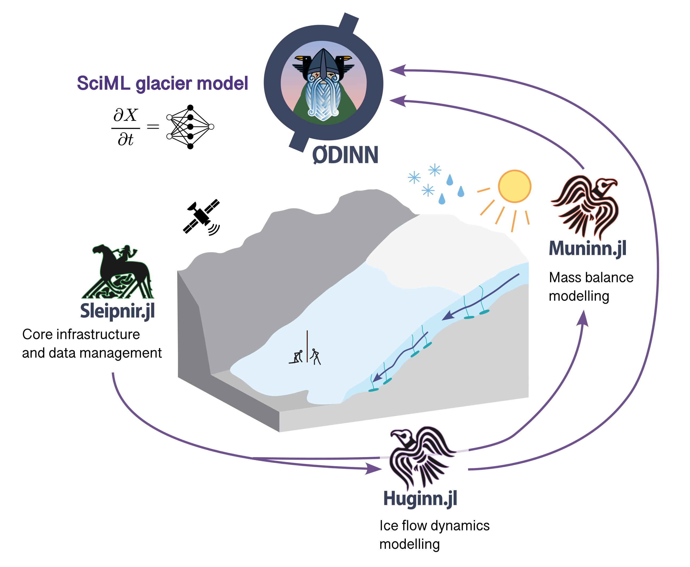

# Summary

`ODINN.jl` is a glacier model leveraging scientific machine learning (SciML) methods to perform forward and reverse simulations of large-scale glacier evolution. It can simulate both surface mass balance and ice flow dynamics through a modular architecture which enables the user to easily modify model components. For this, `ODINN.jl` is in fact an ecosystem composed of multiple packages, each one handling a specific task:

- `Sleipnir.jl`: Handles all the basic types, functions and datasets, common through the whole ecosystem, as well as data management tasks.
- `Muninn.jl`: Handles surface mass balance processes, via different types of models. 
- `Huginn.jl`: Handles ice flow dynamics, by solving the ice flow partial differential equations (PDEs) using numerical methods. It can accommodate multiple types of ice flow models. 
- `ODINN.jl`: Acts as the interface to the whole ecosystem, and provides the necessary tools to differentiate and optimize any model component. It can be seen as the SciML layer, enabling different types of inverse methods, using hybrid models combining differential equations with data-driven models. 

The ODINN ecosystem extends beyond this suite of Julia [@bezanson_julia_2017] packages, by leveraging the data preprocessing tools of the Open Global Glacier Model (@maussion_open_2019, OGGM). We do so via an auxiliary library named `Gungnir`, which is responsible for downloading all the necessary data to force and initialize the model, such as glacier outlines from the Randolph Glacier Inventory (@rgi_consortium_randolph_2023, RGI), digital elevation models (DEMs), ice thickness observations from GlaThiDa [@glathida_consortium_glacier_2019], ice surface velocities from different studies [@millan_ice_2022] and many different sources of climate reanalyses and projections [@lange_wfde5_2019; @eyring_overview_2016]. This implies that `ODINN.jl`, like OGGM, is virtually capable of simulating any of the 200,000 glaciers on Earth. 

`ODINN.jl` provides a high-level user-friendly interface, enabling the user to swap and replace most elements of a glacier simulation in a very modular fashion. The main elements of a simulation, such as the `Parameters`, a `Model` and a `Simulation` (i.e. a `Prediction` or an `Inversion`), are all objects that can be easily modified and combined. In a few lines of code, the user can automatically retrieve all necessary information for most glaciers on Earth, compose a `Model` based on a specific combination of surface mass balance and ice flow models, and incorporate data-driven models (e.g. a neural network) to parametrize specific physical processes of any of these components. Both forward and reverse simulations run in parallel using multiprocessing, leveraging Julia's speed and performance. GPU compatibility is still not ready, due to the difficulties of making everything compatible with automatic differentiation (AD). Nonetheless, it is planned for future versions. 

The most unique aspect of `ODINN.jl` is its differentiability and capabilities of performing all sorts of different hybrid modelling. Since the whole ecosystem is differentiable, we can optimize almost any model component, providing an extremely powerful framework to tackle many scientific problems [@bolibar_universal_2023]. `ODINN.jl` can optimize, separately or together, in a steady-state or transient way:
  
- The initial or intermediate state of glaciers (i.e. their ice thickness `H`) or the equivalent ice velocities `V[x,y]`.
- Model parameters (e.g. the ice viscosity `A` in a 2D Shallow Ice Approximation [@hutter_theoretical_1983]), in a gridded or scalar format. This can be done for multiple time steps where observations (e.g. ice surface velocities) are available.
- The parameters of a regressor (e.g. a neural network), used to parametrize a subpart or one or more coefficients of an ice flow or surface mass balance mechanistic model. This enables the exploration of empirical laws describing physical processes of glaciers, leveraging Universal Differential Equations (UDEs, @rackauckas_universal_2021). 

For this, it is necessary to differentiate through complex code, including numerical solvers, which is non-trivial [@sapienza_differentiable_2024]. We use reverse differentation to compute the required vector-jacobian products (VJPs). We have two strategies to achieve this: (1) manual adjoints, which have been implemented using AD via `Enzyme.jl`, as well as fully manual implementations of the discrete and continuous adjoints; and (2) automatic adjoints using `SciMLSensitivity.jl` [@rackauckas_diffeqfluxjl_2019], providing both continuous and discrete versions and available with different AD back-ends. These two approaches are complementary, with the manual adjoints being ideal for high-performance tasks, and serving as a ground truth for benchmarking and testing automatic adjoint methods from `SciMLSensitivity.jl`.

Beyond all these inverse modelling capabilities, `ODINN.jl` can also act as a more conventional forward glacier model, simulating glaciers in parallel, and easily customizing almost every possible detail of the simulation. Its high modularity, combined with the easy access to a vast array of datasets coming from OGGM, makes it very easy to run simulations, even with a simple laptop. `Huginn.jl` is responisble for the ice flow dynamics models, with an architecture capable of integrating and easily swapping various models. Models based on partial differential equations (PDEs) are solved using `DifferentialEquations.jl` [@rackauckas_differentialequationsjl_2017], which provides access to a huge amount of numerical solvers. For now, we have implemented a 2D Shallow Ice Approximation (SIA, @hutter_theoretical_1983), but in the future we plan to incorporate other models, such as the Shallow Shelf Approximation (SSA, @weis_theory_1999). In terms of surface mass balance, `Muninn.jl` incorporates for now simple temperature-index models. Nonetheless, the main addition of the upcoming version will be the machine learning-based models from the `MassBalanceMachine` [@sjursen_machine_2025], which will become the de-facto solution. Frontal ablation (i.e. calving) and debris cover are not available for now, but we plan to add it to future versions of the model. 

# Statement of need

`ODINN.jl` has been designed to address the need for a glacier model which can leverage both the interpretability and established knowledge coming from the literature in the form of mechanistic models based on differential equations, with the flexibility and data-assimilation capabilities of data-driven models [@bolibar_universal_2023]. The combination of these two paradigms enables a targetted approach to inverse methods for learning parametrizations of glacier physical processes, learning only the unknown physics and keeping a reliable structure in the dynamics in the form of a differential equation. While purely mechanistic and data-driven modelling approaches exist in glaciology, there is a need for flexible models which can leverage existing widely available observations at the glacier surface, to simulate complex physical processes of glaciers, such as basal sliding, creep or calving. Existing laws do not necessarily map available observations with these physical processes, difficulting the finding and calibration of parametrizations and laws. Approaches based on functional inversions and differentiable programming offer the needed flexilibity to derive new empirical laws based on carefully chosen input proxies, which can help to test hypothesis of what can constitute and drive new parametrizations. 

At the same time, a good representation of this complex and poorly represented physical processes is key to accurate predictions of glacier evolution, crucial for their impact to both freshwater resources and sea-level rise. Therefore, with `ODINN.jl`, we provide a unified modelling ecosystem, capable of both flexibile and advance inverse methods for model calibration, as well as efficient and modular methods for forward simulations for large-scale glacier modelling. 

# Acknowledgements

We acknowledge the help of Chris Rackauckas for the debugging and discussion of issues related to the SciML Julia ecosystem, Redouane Lguensat for scientific discussions on the first prototype of the model. JB acknowledges financial support from the Nederlandse Organisatie voor Wetenschappelijk Onderzoek, Stichting voor de Technische Wetenschappen (Vidi grant 016.Vidi.171.063). FS acknowledges funding from the National Science Foundation (EarthCube programme under awards 1928406 and 1928374).

# References

